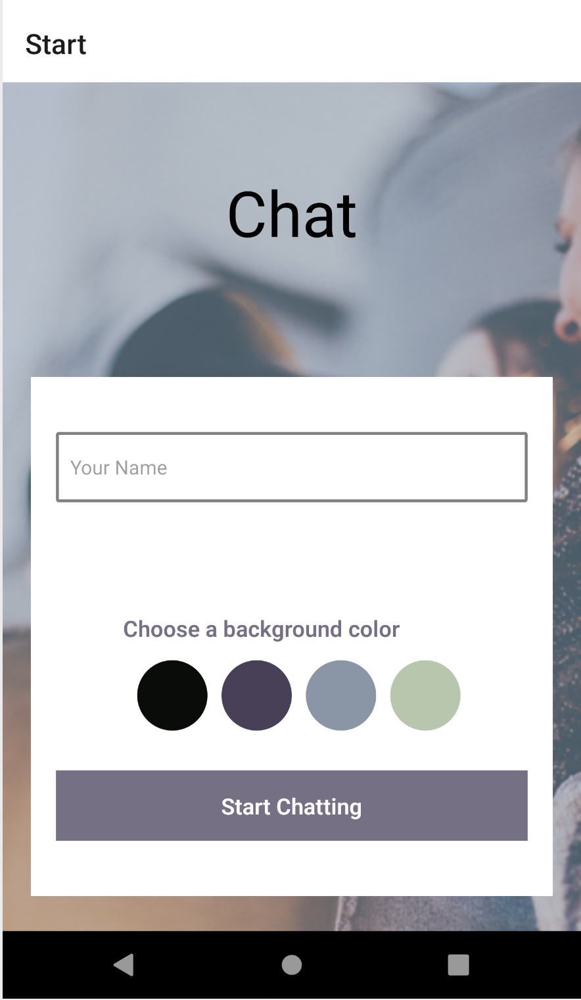

# React Native Chat Application

A real time chatroom application.

## Table of contents

- [Overview](#overview)
  - [Screenshot](#screenshot)
  - [Links](#links)
  - [Built with](#built-with)
  - [What I learned](#what-i-learned)
  - [Continued development](#continued-development)
- [Author](#author)

## Overview

This is a chatroom application built with React Native. The data is managed with Firebase and the chat ui is built with React Native Gifted Chat.

### What it does

Users are able to:

- Enter a username
- Type messages to other users in real time
- Send location information.
- Send images from device media library
- Send images from the camera

### Screenshots

### Built with

- React Native
- React Native Gifted Chat
- Firebase
- Expo

### What I learned

How to use Firebase as a database for a native application. Basics of React Native and making native apps.

### Continued development

I hope to revisit this application and add aditional features and improved UI design in the future.

## Author

- Website - [Curtis Gray](https://curtisgry.github.io/portfolio-website/)